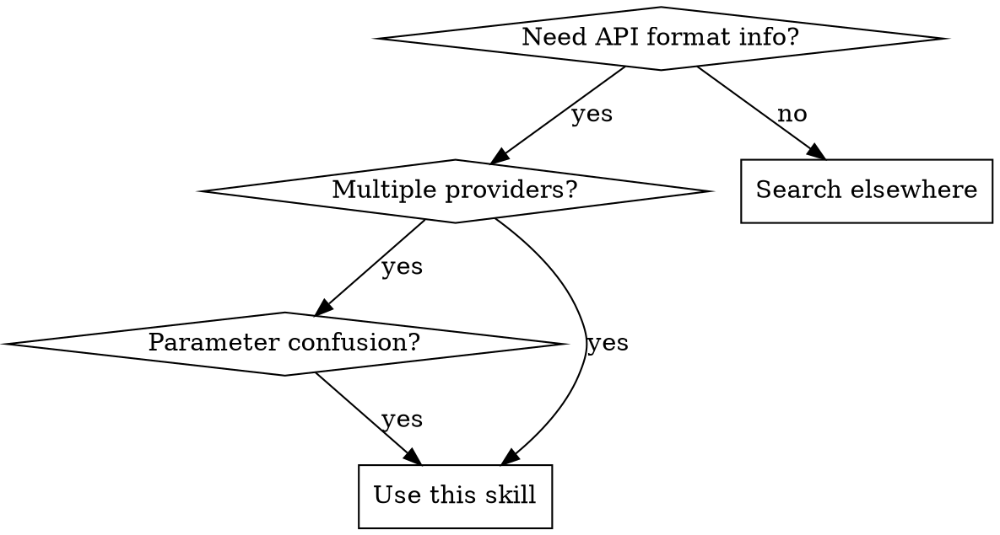

# AI Provider API Reference

## Overview

Quick reference for Anthropic Claude, Google Gemini, Grok (xAI), and OpenAI API formats. Covers URLs, authentication, request/response structures, and parameter support.

## When to Use



**Use when:**
- Implementing multi-provider LLM clients
- unsure about authentication headers
- Confused about message role names
- Need streaming response formats
- Checking which provider supports which parameters

## Quick Reference

### URLs and Authentication

| Provider | Base URL | Auth Header |
|----------|----------|-------------|
| Anthropic | `https://api.anthropic.com/v1/messages` | `x-api-key: <key>` |
| Gemini | `https://generativelanguage.googleapis.com/v1beta/{model}:generateContent` | `x-goog-api-key: <key>` |
| Grok | `https://api.x.ai/v1/chat/completions` | `Authorization: Bearer <token>` |
| OpenAI | `https://api.openai.com/v1/chat/completions` | `Authorization: Bearer <token>` |

**Note:** Anthropic requires `anthropic-version: 2023-06-01` header.

### Message Roles

| Role | Anthropic | Gemini | Grok | OpenAI |
|------|-----------|--------|------|--------|
| User | `user` | `user` | `user` | `user` |
| Assistant | `assistant` | `model` | `assistant` | `assistant` |
| System | **separate field** | `systemInstruction` | in `messages` | in `messages` |

### Required Fields

| Field | Anthropic | Gemini | Grok | OpenAI |
|-------|-----------|--------|------|--------|
| `model` | ✅ | ✅ | ✅ | ✅ |
| `messages`/`contents` | ✅ | ✅ | ✅ | ✅ |
| `max_tokens` | ✅ **required** | optional | optional | optional |

### Streaming End Markers

| Provider | End Marker |
|----------|------------|
| Anthropic | `message_stop` event (8 event types total) |
| Gemini | SSE (no special end marker) |
| Grok | `data: [DONE]` |
| OpenAI | `data: [DONE]` |

### Parameter Support

| Parameter | Anthropic | Gemini | Grok | OpenAI |
|-----------|-----------|--------|------|--------|
| `temperature` | ✅ (0-1) | ✅ (0-2) | ✅ (0-2) | ✅ (0-2) |
| `top_p` | ✅ | ✅ | ✅ | ✅ |
| `top_k` | ✅ | ✅ | ❌ | ❌ |
| `presence_penalty` | ❌ | ✅ | ❌ (reasoning models) | ✅ |
| `frequency_penalty` | ❌ | ✅ | ❌ (reasoning models) | ✅ |
| `stop` | ✅ (`stop_sequences`) | ✅ (`stopSequences`) | ❌ (reasoning models) | ✅ |
| `tools` | ✅ | ✅ | ✅ | ✅ |
| `stream` | ✅ | ✅ | ✅ | ✅ |
| Safety filtering | ❌ | ✅ (`safetySettings`) | ❌ | ❌ |

### Grok Reasoning Model Limits

Grok-4 series reasoning models **do not support**: `stop`, `presence_penalty`, `frequency_penalty`

### Request Body Structure

```json
// Anthropic / Grok / OpenAI (similar)
{
  "model": "model-name",
  "messages": [{"role": "user", "content": "..."}],
  "temperature": 0.7,
  "max_tokens": 1024
}

// Gemini (different structure)
{
  "contents": [{"role": "user", "parts": [{"text": "..."}]}],
  "generationConfig": {
    "temperature": 0.7,
    "maxOutputTokens": 1024
  }
}

// Anthropic (system as separate field)
{
  "model": "claude-opus-4-6",
  "max_tokens": 1024,
  "system": "System prompt here",
  "messages": [...]
}
```

### Response Structure

```json
// Anthropic
{
  "content": [{"type": "text", "text": "..."}],
  "stop_reason": "end_turn",
  "usage": {"input_tokens": 10, "output_tokens": 20}
}

// Gemini
{
  "candidates": [{
    "content": {"parts": [{"text": "..."}], "role": "model"},
    "finishReason": "STOP"
  }],
  "usageMetadata": {...}
}

// Grok / OpenAI
{
  "choices": [{
    "message": {"role": "assistant", "content": "..."},
    "finish_reason": "stop"
  }],
  "usage": {...}
}
```

**Complete examples:** See `examples.md` for full request/response examples including streaming, tools, multimodal, and error handling.

## Common Mistakes

| Mistake | Fix |
|---------|-----|
| Missing Anthropic `max_tokens` | It's **required**, not optional |
| Using `assistant` for Gemini | Gemini uses `model` role |
| Confusing auth headers | Anthropic uses `x-api-key`, others use `Authorization: Bearer` |
| Wrong Anthropic system prompt | Use **separate** `system` field, not in messages |
| Assuming all support `top_k` | Only Anthropic and Gemini support it |
| Using `stop` on Grok reasoning | Not supported on Grok-4 reasoning models |
| Missing `anthropic-version` | Required header for Anthropic |

## Model Names

| Provider | Models |
|----------|--------|
| Anthropic | `claude-opus-4-6`, `claude-sonnet-4-5`, `claude-haiku-4-5` |
| Gemini | `gemini-2.5-flash`, `gemini-2.5-pro`, `gemini-1.5-pro` |
| Grok | `grok-4-1-fast-reasoning`, `grok-beta`, `grok-vision-beta` |
| OpenAI | `gpt-4o`, `gpt-4-turbo`, `gpt-3.5-turbo`, `o1`, `o3` |