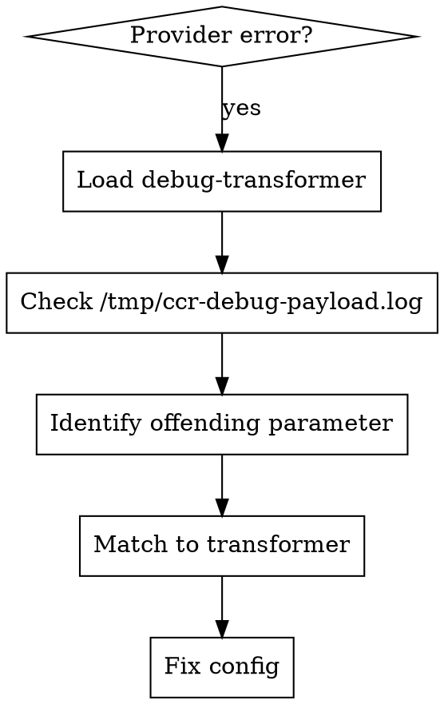

# Claude Code Router Provider Error Debug

## Overview
Systematic workflow for debugging provider API errors using debug-transformer and transformer knowledge.

## Debug Workflow



## Step 1: Enable debug-transformer

Add to provider config in `~/.claude-code-router/config.json`:

```json
{
  "Providers": [{
    "name": "offending_provider",
    "transformer": {
      "use": ["debug-transformer", "...other transformers"]
    }
  }]
}
```

Restart: `ccr restart`

## Step 2: Check Debug Log

```bash
cat /tmp/ccr-debug-payload.log
```

Look for the actual request body sent to provider.

## Step 3: Transformer Reference

| Parameter | Added By | Fix |
|-----------|----------|-----|
| `reasoning.enabled` | `reasoning` | Use `cerebras` transformer (deletes reasoning) |
| `cache_control` | `anthropic`, `openrouter` | Add `cleancache` transformer |
| `media_type` in `image_url` | Raw image content | Use `openrouter` or `vercel` transformer |
| `$schema` in tools | `enhancetool` | Use `groq` transformer (deletes $schema) |
| `max_completion_tokens` | `maxcompletiontokens` | Remove transformer if provider uses `max_tokens` |
| `stream_options.include_usage` | `streamoptions` | Remove if provider doesn't support |

## Common Errors

| Error | Cause | Solution |
|-------|-------|----------|
| `Unknown parameter: 'reasoning.enabled'` | `reasoning` transformer | Use `cerebras` instead |
| `Unknown parameter: 'cache_control'` | Cache control fields | Add `cleancache` transformer |
| `400 Bad Request` | Unsupported parameter | Check debug log, match to transformer |
| `401 Unauthorized` | API key issue | Verify API key rotation config |
| `500 Internal Server Error` | Provider issue | Check provider status, retry |

## Quick Fix Pattern

1. Load debug-transformer → restart → trigger error
2. Read `/tmp/ccr-debug-payload.log` → find offending parameter
3. Match parameter to transformer (table above)
4. Remove/replace transformer in config → restart
