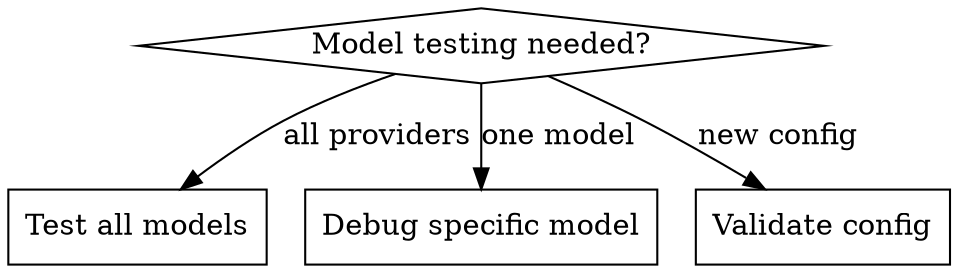

# Claude Code Router - Test All Models

## Overview
Test all provider-model combinations to verify availability, diagnose connection issues, and validate API configurations.

## When to Use



**Use when:**
- Testing provider-model availability before deployment
- Debugging connection issues (401, 500, timeout)
- Validating API key configuration
- Checking which models are actually working
- Comparing response times across providers

**NOT for:**
- Testing transformer configuration (use `claude-code-router-provider-error-debug`)
- Modifying provider settings
- Analyzing performance metrics

## Quick Reference

| Task | Command |
|------|---------|
| Test all models | `./test-all-provider-models.sh` |
| Save to JSON | `./test-all-provider-models.sh -o results.json` |
| Query specific model | `./test-all-provider-models.sh -q provider:model` |
| Increase timeout | `./test-all-provider-models.sh -t 30` |
| Adjust concurrency | `./test-all-provider-models.sh -j 10` |

## Script Location

```
.claude/skills/claude-code-router-test-all-models/test-all-provider-models.sh
```

## Usage

### Test All Models

```bash
# Default test (port 3456, 5 parallel jobs, 15s timeout)
./test-all-provider-models.sh

# Save results to JSON
./test-all-provider-models.sh -o results.json

# Custom concurrency and timeout
./test-all-provider-models.sh -j 10 -t 30
```

### Query Specific Provider-Model

```bash
# Get full request/response details
./test-all-provider-models.sh -q cli-proxy-api:glm-4.7

# Query and save to JSON
./test-all-provider-models.sh -q cli-proxy-api:glm-4.7 -o result.json
```

### Custom Configuration

```bash
# Custom API URL and API key
./test-all-provider-models.sh -u http://localhost:8080 -k sk-xxx

# Custom test prompt
./test-all-provider-models.sh -p "Say 'test'"
```

## Command Options

| Option | Description | Default |
|--------|-------------|---------|
| `-u, --url` | API base URL | `http://localhost:3456` |
| `-k, --api-key` | API key for authentication | (none) |
| `-j, --jobs` | Number of parallel jobs | `5` |
| `-t, --timeout` | Request timeout (seconds) | `15` |
| `-p, --prompt` | Test prompt message | `"Hello, please respond with 'OK'..."` |
| `-o, --output` | Save results to JSON file | (none) |
| `-q, --query P:M` | Query specific provider:model | (none) |
| `-h, --help` | Show help message | - |

## Output Format

### Console Summary

```
═══════════════════════════════════════════════════════════════
                      TEST SUMMARY
═══════════════════════════════════════════════════════════════
  Total Tests:     81
  Successful:      81
  Failed:          0
  Success Rate:    100.0%
  Avg Duration:    2207ms
═══════════════════════════════════════════════════════════════
```

### JSON Output

```json
[
  {
    "provider": "cli-proxy-api",
    "model": "glm-4.7",
    "duration_ms": 2302,
    "http_code": 200,
    "request": {...},
    "response": {...}
  }
]
```

## Common Errors

| Error | HTTP Code | Cause | Solution |
|-------|-----------|-------|----------|
| `"Unauthorized"` | 401 | Invalid API key | Check `api_key` in config.json |
| `"model_not_found"` | 400/404 | Model name mismatch | Verify model name in provider config |
| `"Failed to connect"` | 500 | Provider down | Check provider API URL and network |
| `"Request timeout"` | 200 | Slow provider | Increase timeout with `-t 30` |
| `"auth_unavailable"` | 500 | No auth available | Check API key rotation setup |

## Integration with Other Skills

- **Debugging errors**: Use `claude-code-router-provider-error-debug` after identifying failing models
- **Config changes**: Test before and after config modifications to verify impact